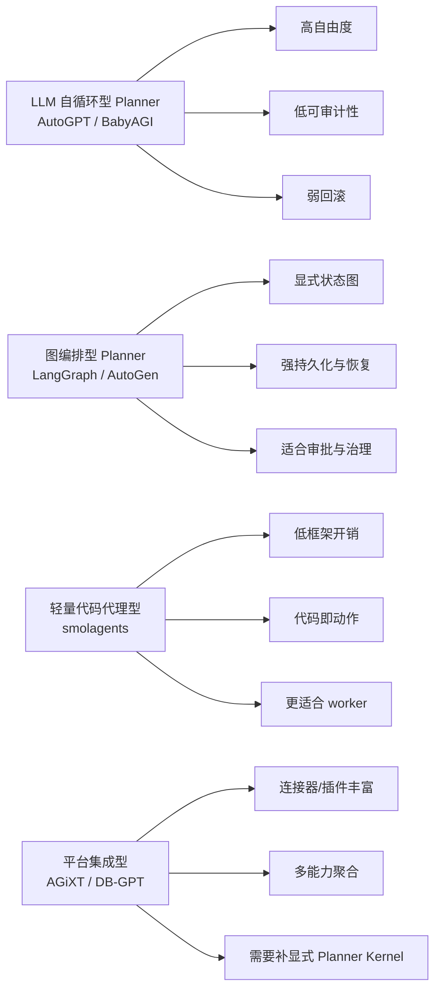
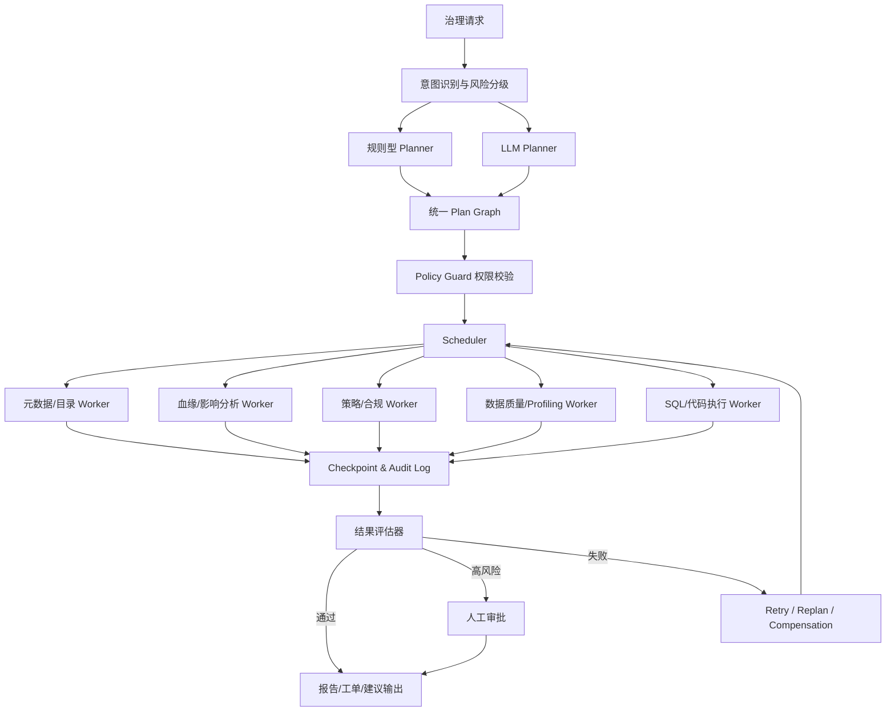

# 现有开源 AI Agent 设计与面向数据治理的 DB-GPT Planner 分析报告

## 执行摘要

这次调研的核心结论很明确：**如果目标是基于 DB-GPT 构建“数据治理垂直领域”的 AI Agent，最值得借鉴的不是 AutoGPT / BabyAGI 这一类“LLM 自循环”式 Planner，而是以 LangGraph 为代表的“显式状态图 + 持久化 + 中断/回溯”路线，再吸收 AutoGen 的事件驱动协作与干预机制，外加 smolagents 的轻量代码执行器思路，最终落到 DB-GPT 自身最有优势的数据连接、SQL/代码执行、技能与沙箱能力上。**LangGraph 官方把 agent 建模为节点、边与共享状态；提供持久化、durable execution、interrupt、time-travel、短期/长期记忆与权限控制；Deep Agents 还补上了 todos、subagents、async subagents、filesystem 权限与沙箱，这与数据治理场景要求的**可审计、可恢复、可控副作用**高度一致。citeturn27view0turn27view1turn27view2turn28view4turn28view6turn28view7turn31view0turn32view1

相反，AutoGPT Classic 官方已明确标注**从安全角度不再支持**，而且其核心范式仍然是“LLM 反复 propose_action / execute”，更适合做历史参考而不适合作为治理主干；BabyAGI 原始实现也主要是**任务创建—重排—执行**的无限循环，优点是极简，缺点是任务爆炸、状态粗糙、回滚弱、审计薄。当前 BabyAGI 主仓库已经转向以 `functionz` 为核心的函数注册/依赖图/日志框架，并明确提示**不面向生产**，因此在今天更适合把它看成“函数工作台”和最小原型，而不是企业治理 Planner 的模板。citeturn33view0turn38view0turn39view0turn9view0turn10view0turn41view0turn41view1turn41view2turn41view3

微软系开源里，**应优先参考 AutoGen，而不是把 Orca 当作 Agent 框架**。AutoGen 官方把自身定位为“构建 AI agents and applications 的 framework”，并将体系拆为 AgentChat、Core、Extensions、Studio；其中 Core 是事件驱动、可分布式、可观测的 Actor 模型运行时，AgentChat 提供 Team、SelectorGroupChat、GraphFlow、Memory、State、Tracing，Extensions 则提供 Docker 代码执行、MCP workbench 与分布式运行时。它非常适合借鉴**治理工作流中“显式团队编排、intervention handler、termination、save/load state、OpenTelemetry tracing”**这些工程能力；但需要注意，AutoGen 官方仓库 README 已标注**maintenance mode**，因此更适合作为模式来源，而不是你长期绑定的唯一主框架。citeturn19view0turn22view0turn22view1turn23view0turn24view1turn24view3turn24view5turn24view6turn25view0turn26view0turn26view3turn20view3

Hugging Face 这条线当前也很清晰：**`transformers` 的 agents 已在 v4.52 被移出，并独立到 `smolagents`**。smolagents 的优势是“轻、明白、代码即动作、工具调用和多 agent 管理简单”，其官方文档还提供 OpenTelemetry、MLflow、Langfuse 遥测、异步应用、交互式计划定制与安全代码执行教程；但它缺少 LangGraph 那种“默认强持久化 + 时间旅行 + 图级回溯”的底盘，因此更适合做**治理执行 worker**，而不是治理总 Planner。citeturn17view0turn17view1turn18view4turn44view0turn45view0

从 DB-GPT 自身能力看，它已经具备成为数据治理 Agent 平台的关键底座：官方将其定位为“open-source agentic AI data assistant”，强调连接数据库/CSV/Excel/仓库/知识库、自动写 SQL、运行 Python/代码分析、加载和执行 skills、生成报告图表、并在沙箱中安全执行任务；仓库也已拆分为 `dbgpt-core`、`dbgpt-app`、`dbgpt-sandbox`、`dbgpt-serve`、`skills` 等模块。**因此最优路线不是替换 DB-GPT，而是在 DB-GPT 之上补一个治理专用 Planner Kernel。**这个 Planner Kernel 应采用“双层规划”：**规则优先的治理 DAG**处理高频、可审计任务；**LLM Planner**只处理歧义、缺口补全和例外场景。citeturn46view0turn47view0

## 调研范围与评估框架

本报告覆盖并重点比较了六类开源候选：**LangChain / LangGraph、AutoGPT、BabyAGI、Agent-LLM 的当前官方落点 AGiXT、Hugging Face smolagents / transformers agents、Microsoft AutoGen**；同时将 **DB-GPT**作为落地目标平台，而不是单独的“竞品”框架。之所以把微软系案例落在 AutoGen，是因为 AutoGen 官方文档明确将其定义为 agent/application framework，而用户提到的 Orca 更接近模型与蒸馏谱系，不是通用 Planner 框架。citeturn19view0turn15view2

针对“数据治理垂直领域”的 Planner，我采用了比通用聊天 Agent 更严格的一组评价标准：**Planner 职责边界是否清晰，任务分解是否可审计，状态是否可持久化，失败后能否恢复，是否支持并发与多资产批处理，权限与审批是否内建，可观测性是否足以追责，以及对 SQL / 元数据 / 血缘 / 数据质量 / 脱敏 /授权审批这类治理任务是否天然友好。**这些要求与 LangGraph 的 state/checkpoint/thread 设计、AutoGen 的 runtime/intervention/tracing 设计、DB-GPT 的数据接入与沙箱设计是高度契合的。citeturn29view0turn29view3turn24view3turn24view5turn46view0

下图把本次调研中最重要的 Planner 原型归纳为四类。它不是某个框架的官方图，而是对官方文档与源码结构的抽象总结。LangGraph / AutoGen 明显属于“图编排 / 运行时驱动”，AutoGPT / BabyAGI 属于“LLM 自循环”，smolagents 更接近“轻量代码代理”，而 AGiXT / DB-GPT 更接近“平台集成型编排”。这种分层解释了为什么数据治理场景应优先选择**图编排**而非**自循环**。citeturn27view0turn29view6turn33view0turn10view0turn18view4turn19view0turn43view1turn46view0



## 候选框架总览

下表先给出一个面向 Planner 的压缩总览。为了避免“表格很全但不可读”，每一行只保留最影响架构选型的信息。

| 项目 | 官方入口 | 官方图示 | Planner 职责与接口 | 分解与调度 | 状态、记忆、回溯 | 并发、多任务、异常 | 可插拔、安全、可观测 | 数据治理适配判断 | 证据 |
|---|---|---|---|---|---|---|---|---|---|
| LangChain / LangGraph | LangGraph docs、Deep Agents docs、repo | 有，官方工作流/agent/Deep Agents 页面均给出流程图与执行图 | Planner 通常以 **StateGraph/节点/边/共享 state** 形式出现；Deep Agents 额外提供 `write_todos`、subagents、permissions、memory 等能力 | 支持 routing、parallelization、orchestrator-worker、evaluator-optimizer、Send API 与 async subagents；适合“治理 DAG + 例外重规划” | checkpointer、thread、checkpoint、pending writes、durable execution、interrupt、time-travel、短期/长期 memory 均是内建一等能力 | super-step 可并发；失败后可从 checkpoint 恢复；对副作用要求幂等；支持 fork 重跑 | 扩展点非常多；Deep Agents 有文件权限规则与多种沙箱；可事件流；生产观测常与 LangSmith 结合 | **最适合做治理主 Planner**。优点是可审计、可恢复、可分层；缺点是工程抽象较多，需要你自己定义治理语义与副作用边界 | 官方文档/源码 citeturn27view0turn27view1turn27view2turn28view4turn28view6turn28view7turn29view0turn29view3turn29view6turn31view0turn32view1turn30view0 |
| AutoGPT Classic / Platform | Classic docs、repo、Platform docs | 有组件划分与平台模块说明，但 Planner 图不如 LangGraph 显式 | Classic 中 Planner 核心是 `BaseAgent.propose_action` / `execute`；Platform 侧更偏 reusable blocks / workflows | Classic 支持多种 prompt strategy 文件，如 `plan_execute`、`reflexion`、`rewoo`、`tree_of_thoughts`；但主范式仍是 LLM 迭代循环 | 有工作区权限配置与 agent-specific permissions；但缺少强一致 checkpoint / time-travel 级别的通用回溯能力 | 主仓库活跃，但 **Classic 官方标注安全不再维护**；异常恢复更多靠 prompt、自循环与人工确认 | Agent Protocol、Forge、Benchmark、Blocks 是优点；安全边界与治理级审计能力不足 | **只适合借鉴 prompt strategy 与 benchmark，不适合直接做治理核心 Planner** | 官方文档/源码 citeturn33view0turn33view1turn35view0turn38view0turn39view0turn7view3turn7view4 |
| BabyAGI 原始实现 | archive README 与 `babyagi.py` | 有，README 给出 How It Works 图 | Planner 极简：`task_creation_agent` 生成任务，`prioritization_agent` 重排任务，`execution_agent` 执行任务 | 任务队列基于 `deque`；上下文来自向量库检索；调度策略本质是单线程循环 + 重排 | 只有任务队列与结果检索，几乎没有事务性回滚；恢复多靠重新运行 | API 错误会 sleep 后重试；没有通用 undo/compensation；易出现 task explosion | 原始版本是极简教学样板；当前主仓库已转向 `functionz`、依赖图、dashboard，并明确不面向生产 | **适合作为最小原型与反例库**：优点是好懂；缺点是治理所需的权限、审计、恢复、并发、审批都不足 | 官方文档/源码 citeturn10view0turn41view0turn41view1turn41view2turn41view3turn9view0 |
| Agent-LLM 当前官方落点 AGiXT | AGiXT repo | 未看到像 LangGraph 那样的统一 Planner 图，更像平台模块树 | Planner 不是单独一层，而是散在 `Agent.py`、`Task.py`、`Chain.py`、`TaskMonitor.py`、`Memories.py`、`Extensions.py` 中 | 更偏“任务 + 链 + 插件/扩展 + 多渠道 bot manager”；适合集成，不适合把治理推理逻辑藏进黑盒链条 | 有 memory、conversation、machine state、task monitor 等部件，但本轮未确认到强 checkpoint/time-travel 机制 | 模块丰富，真实世界接口多；但 scheduler 语义不如 LangGraph/AutoGen 清楚 | MIT；支持多 provider、多租户、OAuth、扩展与 webhook；适合集成企业工具链 | **适合作为连接层/集成层参考，不宜直接作为治理 Planner 核** | 官方 README/源码 citeturn15view2turn15view1turn42view1turn43view0turn43view1turn43view2 |
| Hugging Face smolagents | smolagents docs / repo；legacy transformers agents | 有教程图、遥测图；legacy agents 页明确标注 deprecated | Planner 主要体现在 `CodeAgent` / `ToolCallingAgent` 及 managed agents；更偏“代码驱动步骤执行” | 可以用 managed agents 做层级协作；更轻；适合将复杂动作落到代码与工具上 | 内置 memory 与 human-in-the-loop 教程存在，但整体更轻量；未见 LangGraph 那种图级 durable state | 安全执行是强项；异步/多 agent 更像能力扩展而非统一 runtime；无强 rollback 主干 | `transformers` agents 已移除；smolagents 支持 OpenTelemetry、MLflow、Langfuse；强调沙箱，警告 LocalPythonExecutor 不可当安全边界 | **非常适合做治理 worker，如 SQL 修复、规则生成、profile 脚本执行；不适合独立承担治理总 Planner** | 官方文档/源码 citeturn17view0turn17view1turn18view4turn44view0turn44view5turn45view0 |
| Microsoft AutoGen | AutoGen stable docs / repo | 有 AgentChat、Core、GraphFlow、SelectorGroupChat 与设计模式页面 | Planner 可是一个 Planning Agent，也可由 SelectorGroupChat / GraphFlow / runtime 共同承担；接口层级清晰：AgentChat、Core、Extensions | 支持队伍、动态选 speaker、GraphFlow、并发 agents、handoff、intervention handler；非常适合“审批+协同”的治理流程 | 支持 save/load state、Memory protocol、ListMemory、termination、OpenTelemetry tracing、usage logger | Core 是事件驱动 Actor runtime，可异步、可分布式、可观测；但官方仓库处于 maintenance mode | 扩展丰富，DockerCommandLineCodeExecutor、MCP、gRPC runtime 都是优点；长期路线需谨慎 | **非常值得借鉴其 runtime / intervention / tracing / graph pattern，但更适合作为设计来源而非唯一绑定框架** | 官方文档/源码 citeturn19view0turn22view0turn22view1turn23view0turn24view1turn24view3turn24view5turn24view6turn25view0turn26view0turn26view3turn20view3 |
| DB-GPT | DB-GPT repo | 有产品级能力展示图；本轮未成功抓取更深 docs 页面 | 现有能力强在数据接入、SQL/代码执行、skills、沙箱、报告生成；Planner 语义需你补强 | 适合把任务拆成“元数据/SQL/profile/lineage/policy/quality/审批”几个 worker，并放到受控工作流中 | 已有沙箱与 skills；仓库结构已拆成 `dbgpt-core`、`dbgpt-app`、`dbgpt-sandbox`、`dbgpt-serve` 等，适合插入新的 Planner Kernel | 资源画像中等偏重，但对数据治理是“天然场景”；关键短板是缺少显式治理 Planner 状态模型与回滚语义 | MIT；数据接入与执行面很强，是极佳落地底座 | **最佳策略是“DB-GPT 做执行与数据面，LangGraph/AutoGen 思想做 Planner 面”** | 官方 README/源码结构 citeturn46view0turn47view0 |

再把许可证与社区活跃度单独拉出来看，会更利于工程决策。这里的时间点以当前抓取页面为准；两项未完全确认的地方我明确标注为“需复核”，避免误导。citeturn30view0turn7view4turn10view0turn43view0turn44view5turn20view3turn46view0

| 项目 | 许可证 | 社区快照 | 说明 |
|---|---|---|---|
| LangChain / LangGraph | **需复核**。本轮未在抓取片段中直接核验 LICENSE 字段 | LangGraph 约 32.1k stars、5.4k forks、297 issues、244 PR | 社区活跃、文档成熟，工程吸引力强；适合作为主骨架 citeturn30view0 |
| AutoGPT | **需按子模块复核**。Classic / Platform 许可证在本轮未逐一验核 | 主仓库约 184k stars；最新 release 抓到 2026-05-13；Classic 安全不再维护 | 热度仍高，但历史包袱大，Classic 不适合治理生产主线 citeturn7view3turn7view4turn33view0 |
| BabyAGI 原始 archive | MIT | archive 102 stars、444 commits；当前主仓库 22.3k stars，但方向已转 `functionz` | 讨论度高于工程成熟度；原始 planner 仅适合教学 citeturn10view0turn9view0 |
| AGiXT | MIT | 约 3.2k stars；最新 release 抓到 2026-04-08；433 releases | 集成能力强，平台型演化明显 citeturn43view0turn43view1 |
| smolagents | Apache-2.0 | 约 27.3k stars；最新 release 抓到 2026-05-14 | 社区增长快；HF 生态加成大 citeturn18view0turn18view2turn44view5 |
| AutoGen | 代码 MIT，文档 CC-BY-4.0 | 约 58.1k stars；最新 release 抓到 2025-09-30；仓库 maintenance mode | 设计价值仍高，路线选择需谨慎 citeturn20view3turn20view4 |
| DB-GPT | MIT | 约 18.8k stars、2.7k forks、3317 commits、371 issues、38 PR | 作为数据治理基座非常有现实价值 citeturn46view0 |

## 候选项目深度解剖

这一节不再重复大表，而是把每个候选最值得学、最值得复用、最容易踩坑的地方收敛成一张“源码导读表”。其中部分项目我只能确认到**包级路径**而未扩展到更细粒度文件，这里会据实说明。

| 项目 | 关键代码路径与文件 | 推荐学习点与可复用模块 | 需要避免的反模式 |
|---|---|---|---|
| LangChain / LangGraph | `libs/langgraph/langgraph/graph/state.py`；`libs/langgraph/langgraph/runtime.py`；`libs/prebuilt/langgraph/prebuilt/chat_agent_executor.py`；`libs/checkpoint/langgraph/checkpoint/...`；Deep Agents 文档中的 permissions / memory / async subagents 页面 | **Typed state、checkpointer、interrupt / time-travel、pending writes、orchestrator-worker、Send API、async subagents、filesystem permissions** 都非常适合直接映射到治理 Planner；可复用“线程级短期记忆 + store 级长期记忆”分层 | 把 prompt 文本直接存进 state；在 `interrupt` 前做不可幂等副作用；让治理动作退化成无限自由聊；把 LangSmith 专属能力误当作开源内建能力 citeturn30view1turn30view2turn30view3turn30view4turn27view0turn28view4turn28view5turn28view6turn29view0turn29view3turn31view0turn32view1 |
| AutoGPT Classic / Platform | `classic/original_autogpt/autogpt/agents/agent.py`；`agent_manager.py`；`agents/prompt_strategies/base.py`、`plan_execute.py`、`reflexion.py`、`rewoo.py`、`tree_of_thoughts.py`；`autogpt/app/`；Platform blocks 文档 | 值得学的是 **`propose_action` / `execute` 分离、Agent Protocol、benchmark、prompt strategy 目录化**；这些可作为“实验田”和评测工具 | 不要把“LLM 一直想一想再试一试”当成治理主流程；不要忽略 Classic 已不再安全维护；不要把 prompt strategy 误当成状态机替代物 citeturn38view0turn39view0turn39view1turn33view0turn33view1 |
| BabyAGI 原始实现 | `babyagi_archive/babyagi.py`；当前 BabyAGI 的 `babyagi/functionz/`、`dashboard/`、`api/` 路径 | 原始版最值得学的是**任务创建—重排—执行**的最小闭环；当前版最值得学的是 **function registry、依赖图、执行日志、dashboard** 这些“函数级工作台”能力 | 任务列表无限膨胀；没有显式任务依赖图只靠文字重排；无审批、无回滚、无强权限边界；把当前 repo 当生产框架使用 citeturn41view0turn41view1turn41view2turn41view3turn40view0turn9view0 |
| AGiXT | `agixt/Agent.py`；`Chain.py`；`Task.py`；`TaskMonitor.py`；`Memories.py`；`Extensions.py`；`MachineState.py`；`Workspaces.py`；`Websearch.py` | 可复用的是**任务监控、链式动作、记忆、扩展中心、与现实世界系统的接入层**；对“治理平台外设”很有价值 | 不要把调度语义埋在 chain / extension 组合里而缺少显式 plan graph；不要让 governance policy 与 bot/integration 层耦合成一个大平台对象 citeturn42view1turn43view1turn43view4 |
| smolagents / legacy transformers agents | `src/smolagents/agents.py`；官方 telemetry / secure execution / memory / async app 教程；legacy `transformers` agents 页面 | 最值得学的是 **CodeAgent 的“代码即动作”、managed agents、多后端沙箱、OpenTelemetry 接入**；对 SQL 修复、profile 脚本生成、规则探测 worker 很有帮助 | 不要基于已废弃的 `transformers` agents 新建核心；不要把 `LocalPythonExecutor` 当安全边界；不要让轻量 worker 承担治理总控职责 citeturn17view0turn18view4turn44view0turn45view0 |
| AutoGen | 本轮能高置信确认到的是**包级路径**：repo 下 `python/`、`docs/`、`protos/`；能力对应 `AgentChat`、`Core`、`Extensions`、`GraphFlow`、`SelectorGroupChat`、`Memory`、`Tracing` 页面 | 值得复用的是 **事件驱动 runtime、team/selector/graph workflow、state save/load、intervention handler、usage logger、OpenTelemetry tracing**；这套模式非常适合治理型审批流 | 不要用多 agent 自由对话代替明确工作流；不要忽略 maintenance mode；不要在高频低价值任务上滥用 selector/group chat，成本和延迟会偏高 citeturn19view0turn22view0turn22view1turn23view0turn24view1turn24view3turn24view5turn24view6turn25view0turn26view0turn26view3turn20view3 |
| DB-GPT | `packages/dbgpt-core/`、`packages/dbgpt-app/`、`packages/dbgpt-sandbox/`、`packages/dbgpt-serve/`、`skills/`、`examples/`、以及 legacy `pilot/` | 最值得复用的是**多源数据接入、SQL / 代码分析、skills、sandbox、报表输出**；这些都非常贴合数据治理执行面 | 不要把 DB-GPT 直接当“已有完善治理 Planner”；若没有显式 state/plan/approval/checkpoint 层，治理任务会变成“能跑但难审计”的黑盒流水线 citeturn46view0turn47view0 |

如果只从“推荐学习点”的角度给一个很实用的排序，我会这样建议：**第一个读 LangGraph，第二个读 AutoGen，第三个读 DB-GPT 源码结构，第四个读 smolagents，之后再看 AutoGPT 的 prompt strategies 与 BabyAGI 的极简闭环。**前两个决定你的 Planner 形状，第三个决定你的数据面与执行面，第四个决定你的轻量 worker，后两个主要帮助你识别该保留什么、该避免什么。这个结论是对上面各项目官方定位与源码结构的综合判断。citeturn27view0turn19view0turn46view0turn18view4turn39view0turn41view2

## 面向数据治理 Planner 的横向结论

数据治理和通用智能助理最大的区别，在于它不是一个“只要答得像样就行”的问题，而是一个**要对数据资产、策略文本、执行副作用、审批责任和审计留痕负责**的问题。因此，治理 Planner 的首要目标不是“看起来更聪明”，而是**可确认、可解释、可恢复、可审批**。从这一点看，LangGraph 和 AutoGen 的设计比 AutoGPT / BabyAGI 天然更对路，因为它们都把**状态与控制流**显式抽出来了；而 AutoGPT / BabyAGI 的运行主线则更多依赖 LLM 在循环中生成下一步。citeturn29view0turn29view3turn24view5turn25view0turn33view0turn10view0

如果把数据治理任务进一步拆开，会发现其中大多数其实并不需要“开放式智能体”——它们需要的是**带有少量智能分支的治理工作流**。典型任务包括：识别资产范围、拉取元数据与血缘、比对权限策略、生成/执行数据质量规则、识别敏感字段、生成整改建议、必要时触发人工审批。这类任务与 LangGraph 的 routing / orchestrator-worker / short-term & long-term memory / interrupt 极为吻合；与 AutoGen 的 SelectorGroupChat、GraphFlow、InterventionHandler 也能良好映射。换句话说，治理场景更适合“**workflow first，agent second**”，而不是“对话 first”。citeturn29view6turn28view7turn28view5turn26view0turn26view3turn24view5

性能与资源方面，本报告不做未经实测的绝对数值比较，但可以给出**架构级推断**：AutoGPT / BabyAGI 这类“循环式反思—再调用”框架，通常会产生更高的 token churn 与更难控的尾延迟；AutoGen 和 LangGraph 因为有 runtime / checkpoint / tracing / team 这类能力，控制面更重，但在失败恢复、治理审计和批任务协作上收益明显；smolagents 是最轻的一类，适合做高频 worker；AGiXT 与 DB-GPT 更像“平台”，其资源成本更多来自连接器、执行器和 sandbox，而不是 Planner 本身。这个推断与各自官方公开的运行时、持久化、沙箱、遥测特征是一致的。citeturn28view4turn29view1turn24view3turn24view6turn44view0turn45view0turn43view1turn46view0

近一两年的学术/工业研究也强化了这个方向。AgentRM 指出当前 agent 框架最容易在**调度失败与上下文退化**上出问题，并提出 OS 风格的资源管理；AgentForge 强调**执行反馈与 sandbox verification** 对可靠性的重要性；TalkHier 强调**结构化协作与层级化 refinement**；Agent-UniRAG 则表明 step-by-step agent framework 对复杂检索增强任务更有解释性。把这些结论映射到数据治理上，得到的实践原则就是：**治理 Planner 必须先有 scheduler、context lifecycle、execution verification，再谈更自由的 agent intelligence。**citeturn11academia0turn12academia1turn12academia9turn12academia0

因此，面向数据治理的推荐组合不是“选一个框架梭哈”，而是：

**主干选择**：LangGraph 风格的显式 plan graph、checkpointer、time-travel、interrupt。citeturn28view4turn28view6turn29view0turn29view3

**协作机制**：吸收 AutoGen 的 GraphFlow、Intervention Handler、team/runtime 语义，用于审批、质检、冲突仲裁和并发 worker 编排。citeturn26view3turn24view5turn25view0

**执行 worker**：吸收 smolagents 的 CodeAgent / ToolCallingAgent 思路，尤其适合把 SQL 生成、profile 脚本、规则修复脚本、报告拼装这些动作落成代码。citeturn18view4turn45view0

**数据与工具面**：直接用 DB-GPT 的多源数据访问、skills、sandbox、分析与报告输出能力承载。citeturn46view0turn47view0

下图给出我建议的数据治理 Planner 总体流程。这个图同样是综合官方设计后的落地方案，而不是某个项目现成提供的流程图。citeturn27view0turn19view0turn46view0



## 基于 DB-GPT 的实现建议

下面的建议是本报告最重要的落地部分。它的目标不是复述别人的框架，而是给出一个**在 DB-GPT 上可实现、且符合数据治理场景约束**的 Planner 设计清单。

首先，建议采用**双层 Planner**。上层是 **Governance Meta-Planner**，负责把用户请求归类到治理任务模板，比如“敏感字段识别”“权限申请评估”“数据质量规则生成”“血缘影响分析”“目录补全”“整改建议”；下层是 **Execution Graph Planner**，负责把任务落实为可执行 DAG，决定哪些步骤走 deterministic node，哪些步骤调用 LLM worker，哪些步骤必须人工审批。这个设计本质上结合了 LangGraph 的 state graph / interrupt / checkpoint、AutoGen 的 intervention/runtime、DB-GPT 的 skills/sandbox。它能避免 AutoGPT / BabyAGI 式的“每一步都重新让 LLM 想下一步”的高波动。citeturn29view6turn28view5turn24view5turn46view0

建议的接口草案如下。它不是对现有库 API 的复制，而是一个适合在 DB-GPT 中实现的治理 Planner 契约：

```python
from dataclasses import dataclass, field
from typing import Any, Literal, Protocol

TaskKind = Literal[
    "catalog_lookup",
    "schema_profile",
    "lineage_analysis",
    "policy_retrieval",
    "pii_classification",
    "quality_rule_generation",
    "sql_execution",
    "report_render",
    "human_approval",
]

@dataclass
class GovernanceTask:
    task_id: str
    kind: TaskKind
    depends_on: list[str] = field(default_factory=list)
    input_refs: list[str] = field(default_factory=list)
    tool: str | None = None
    retry_budget: int = 2
    timeout_s: int = 15
    risk: Literal["low", "medium", "high"] = "low"
    compensator: str | None = None

@dataclass
class GovernancePlan:
    plan_id: str
    objective: str
    tasks: list[GovernanceTask]
    success_criteria: list[str]
    requires_human_gate: bool = False

@dataclass
class GovernanceState:
    request_id: str
    user_id: str
    tenant_id: str
    objective: str
    intent: str | None = None
    scope_assets: list[str] = field(default_factory=list)
    policy_refs: list[str] = field(default_factory=list)
    short_term_context: dict[str, Any] = field(default_factory=dict)
    long_term_memory_refs: list[str] = field(default_factory=list)
    task_status: dict[str, str] = field(default_factory=dict)
    task_outputs: dict[str, Any] = field(default_factory=dict)
    risk_level: str = "medium"
    checkpoint_id: str | None = None
    audit_events: list[dict[str, Any]] = field(default_factory=list)

class Planner(Protocol):
    async def plan(self, state: GovernanceState) -> GovernancePlan: ...
    async def replan(self, state: GovernanceState, failed_task_id: str) -> GovernancePlan: ...

class PolicyGuard(Protocol):
    async def authorize(self, task: GovernanceTask, state: GovernanceState) -> bool: ...

class Scheduler(Protocol):
    async def dispatch(self, plan: GovernancePlan, state: GovernanceState) -> None: ...

class Checkpointer(Protocol):
    async def save(self, state: GovernanceState) -> str: ...
    async def load(self, checkpoint_id: str) -> GovernanceState: ...
    async def fork(self, checkpoint_id: str, patch: dict[str, Any]) -> str: ...
```

这个接口里最关键的不是类名，而是三件事。**第一，task 必须 typed、可审计、可依赖排序；第二，state 必须把“语义状态”和“审计状态”分开；第三，任何可能产生副作用的 task 都要显式声明补偿器、超时和重试预算。**这正是 LangGraph 对 state/checkpoint/interrupt 的启发，以及 AutoGen 对 intervention/runtime 的启发。citeturn29view0turn29view3turn28view5turn24view5

状态模型建议按**短期 / 长期**两层设计。短期状态使用 thread/request 级别，保存：原请求、当前 plan graph、task cursor、工具输出、审批状态、错误栈、checkpoint 链、审计事件。长期状态则保存：治理词表、组织级 policies、资产画像、常见例外决策、质量规则模板、用户与团队偏好。LangGraph 的文档已经把 thread-level persistence 与跨会话 memory/store 区分得非常清楚；Deep Agents 还进一步强调 short-term memory 属于单线程状态，long-term memory 可作为跨线程文件/存储层。DB-GPT 侧则适合把长期记忆映射到 catalog、policy store、skills 配置与治理知识库。citeturn29view0turn28view7turn32view2turn32view3turn46view0

在任务分解层面，我建议**规则优先**。例如，当请求是“评估把 `customer_core.email` 暴露给营销 BI 的治理风险，并给出最小代价的合规方案”时，不应该先让 LLM 自由发挥，而应该先走一条确定性模板：

| 步骤 | 类型 | 依赖 | 能否并发 | 备注 |
|---|---|---|---|---|
| 解析请求、识别治理意图 | 规则 + 小模型分类 | 无 | 否 | 输出意图 `access_risk_assessment` |
| 拉取资产元数据与标签 | deterministic worker | 无 | 是 | 调 catalog / schema registry |
| 拉取血缘与下游消费影响 | deterministic worker | 无 | 是 | 调 lineage service |
| 拉取组织策略与敏感数据规则 | deterministic worker | 无 | 是 | 调 policy store |
| 敏感字段与用途匹配评估 | LLM + policy constrained | 前三步 | 否 | 只在规则不足处调用模型 |
| 生成整改选项 | LLM worker | 上一步 | 否 | 输出最小披露、脱敏、审批路径 |
| 高风险时审批 | HITL | 风险为高 | 否 | 进入 governance steward |
| 生成最终建议与工单 | deterministic report composer | 全部 | 否 | 归档审计事件 |

这个例子体现的是：**把高波动的 LLM 推理限制在“解释、补全、生成建议”环节，把资产事实、血缘、策略检索、执行结果固化为 deterministic nodes。**这样可以显著降低治理 Planner 的不稳定性。citeturn29view6turn26view3turn46view0

回溯与恢复方面，建议引入**三级策略**。**第一级是 transient retry**，面向数据库暂时不可用、LLM 超时、网络抖动，带指数退避即可；**第二级是 semantic retry**，把上一次失败原因结构化写回 state，再做一次修正调用，比如“SQL 语法错误、需要缩小扫描范围、策略检索命中为空”；**第三级是 compensation / fork**，对任何产生外部写入的动作不要做“盲目重试”，而要恢复到上一个 checkpoint，在分叉分支上重跑。LangGraph 的 pending writes、durable execution、time-travel/fork，为这种机制提供了非常直接的参考；AutoGen 则可借鉴 intervention handler 作为运行时“刹车”。citeturn29view3turn28view4turn28view6turn24view5

但要特别强调一个治理场景中的工程原则：**把真正会修改生产对象的动作压缩到最少，并尽量改成“建议、草稿、工单、临时视图、临时规则”，只有经过审批才做持久写入。**这样，“undo” 才不需要依赖魔法般的逆操作，而是依赖明确的 compensator 或审批后执行。smolagents 与 DB-GPT 都强调代码/技能执行要放在沙箱中；AutoGen 提供 Docker executor；LangGraph 也反复强调 side effect 的幂等性。这些都说明，治理 Agent 的正确做法不是“给模型数据库写权限”，而是“给 Planner 安全边界内的可审查执行器”。citeturn44view0turn20view2turn28view5turn46view0

并发策略上，建议不要上来就做 fully open multi-agent debate，而应该采用**分波次并发**。第一波并发跑资产元数据、血缘、策略检索、采样 profile；第二波用一个聚合节点合并结果；第三波按风险决定是否触发 LLM 分析与审批。其理由很简单：数据治理任务往往是**I/O 并发收益大、思维并发收益小**。LangGraph 的 parallelization / orchestrator-worker 与 AutoGen 的 concurrent agents / GraphFlow 都支持这种模式，但前者更适合拿来做核心控制。citeturn29view5turn29view6turn25view0turn26view3

测试用例建议至少覆盖五类。**功能正确性**：策略理解、PII 识别、规则生成、血缘影响评估、访问请求裁决。**控制流正确性**：中断恢复、审批后续跑、失败重规划、重复执行幂等。**异常恢复**：LLM timeout、DB auth failure、catalog miss、policy store stale。**安全边界**：越权工具调用、读取敏感配置、绕过沙箱、错误执行器选择。**性能基准**：单资产、十资产、百资产三档；并发 1/5/20 三档；P50/P95 规划延迟、平均 token 消耗、任务成功率、回滚率、审批命中率、误报率。近期研究已经反复说明，调度与上下文管理是 agent 失效高发点，因此压测不能只看“答对率”，必须把“排队—恢复—内存膨胀”也纳入基准。citeturn11academia0turn24view6turn24view3

如果要把这些建议压缩成一句实施策略，那就是：

**在 DB-GPT 中新增一个治理专用 Planner Kernel，采用 LangGraph 式 typed state + checkpoint + plan graph，吸收 AutoGen 式 intervention / graph workflow，使用 DB-GPT 的 connectors / skills / sandbox 承载执行面，使用 smolagents 式 lightweight code worker 处理高变任务。**

## 主要参考链接

- LangGraph 官方总览、Thinking in LangGraph、Persistence、Durable Execution、Interrupts、Time Travel、Memory、Deep Agents、Permissions、Async Subagents。citeturn27view0turn27view1turn27view2turn27view3turn27view4turn27view5turn27view6turn27view7turn31view0turn32view1
- LangGraph 仓库与关键源码路径：`graph/state.py`、`runtime.py`、`prebuilt/chat_agent_executor.py`、checkpoint 包。citeturn30view0turn30view1turn30view2turn30view3turn30view4
- AutoGPT Classic 官方文档、Platform Blocks 文档、Classic 源码目录、Agents README、Prompt Strategies 目录与主仓库状态。citeturn33view0turn33view1turn35view0turn38view0turn39view0turn7view3turn7view4
- BabyAGI 当前仓库 README、archive README 与 `babyagi.py`。citeturn9view0turn10view0turn40view1turn41view0turn41view1turn41view2turn41view3
- Agent-LLM 当前官方仓库重定向到 AGiXT；AGiXT README 与 `agixt/` 源码目录。citeturn15view2turn15view1turn42view1turn43view0turn43view1
- Hugging Face `transformers` legacy agents 页面、smolagents 文档、smolagents 仓库与 OpenTelemetry 教程。citeturn17view0turn17view1turn17view2turn18view0turn44view0turn45view0
- Microsoft AutoGen 官方稳定版文档、AgentChat、Core、Memory/State、Tracing、Concurrent Agents、GraphFlow、Intervention Handler、Usage Logger、GitHub 仓库。citeturn19view0turn22view0turn22view1turn23view0turn23view1turn23view3turn23view4turn23view5turn25view0turn25view3turn20view3
- DB-GPT 官方仓库 README 与 `packages/` 模块结构。citeturn46view0turn47view0
- 辅助学术/工业论文：AgentRM、AgentForge、TalkHier、Agent-UniRAG。citeturn11academia0turn12academia1turn12academia9turn12academia0

## 开放问题与局限

本次报告优先使用了官方文档与官方仓库，但仍有三点需要坦诚说明。其一，**LangGraph 与 AutoGPT 的许可证字段**在本轮抓取片段中没有做到逐 LICENSE 文件复核，因此我对它们写成了“需复核/按子模块复核”，避免把未再次核验的信息当作硬结论。其二，**DB-GPT 的更深层 docs 页面在本次抓取中未稳定返回**，因此关于 DB-GPT 的落地建议更依赖 README、仓库结构与其公开定位，而不是详细的内部 Agent API 文档。其三，**AGiXT 的官方 docs 入口本轮只返回了 XTDocs 门面页**，所以对其 Planner 语义的判断主要依据仓库结构和 README，而不是文档中的运行时细节。

即便如此，报告中的高置信结论仍然稳定：**数据治理 Planner 应该以显式状态图、可恢复执行和审批闸门为核心；DB-GPT 最适合作为执行与数据面底座；LangGraph 是最佳主导参考，AutoGen 是最佳协作/观测参考，smolagents 是最佳轻量 worker 参考；AutoGPT Classic 和 BabyAGI 更适合作为历史模式与反模式教材，而不是基座。**