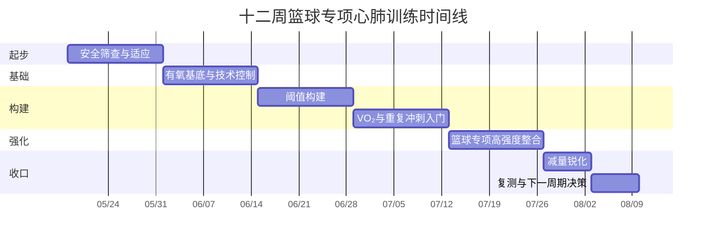

# 面向篮球的循序渐进心肺训练方案深度研究报告

## 执行摘要

基于你提供的信息，这份方案把你视为**34 岁、男性、178 cm、85 kg、久坐程序员、近期无系统训练史、目标是为了篮球提高心肺功能**的成人训练者来设计。对这类人群，最合理的路径不是一上来就大量冲刺或打高强度全场，而是先用 **2–4 周建立有氧基础、组织耐受和落地减速能力**，再引入阈值训练、VO₂max 间歇和篮球专项重复冲刺；整个渐进过渡期做成 **10–12 周**，与 ACSM 强调的 **2–3 个月渐进过渡期**高度一致。篮球比赛本身是高间歇、高变向、高重复冲刺项目，研究显示球员在活球时间里有相当大比例处于 **>85% HRmax** 的强度，平均比赛心率也常处于高位，因此“只慢跑”不够，“只冲刺”也不安全；最有效的方案是把 **Z2/低强度耐力、节奏/阈值、长间歇 HIIT、短冲刺/RSA、力量与低量弹跳**组合起来。citeturn19view2turn22search5turn22search2turn23search1turn25view0

就可执行性而言，**每周 4–5 天训练**已经足够：**2 天心肺主课、2 天力量与基础弹跳、1 天低强度恢复/技术练习**，再根据恢复情况决定是否加入 1 次野球或半场对抗。篮球专项研究和针对健康成人的综述都提示：HIIT 对心肺和专项表现通常有效，重复冲刺训练还能同时改善冲刺、跳跃和有氧能力，而规律阻力训练与弹跳训练有助于提升变向、制动和伤病耐受。对你这种白天久坐、组织耐受可能偏低的人，真正的关键不是把单次课做得“最狠”，而是让训练 **长期可坚持、技术不崩、次日还能恢复**。citeturn24search18turn40search11turn25view0turn37search3turn39view0

## 起点假设与医学安全

本报告在没有额外病史的情况下，采用以下起点假设：**没有近期急性疾病、没有已知心血管/代谢/肾脏疾病、没有近期系统训练史、没有正在恢复中的明显运动损伤**。你的 BMI 约为 **26.8**，再叠加久坐职业特征，意味着你的心肺可塑性通常不错，但下肢组织耐受、跟腱/髌腱/踝膝对高冲击与高频变向的适应，很可能落后于你的意志和主观兴奋度，所以方案把前几周的重点放在**渐进**而不是“硬顶”。ACSM 的更新版筛查框架强调，是否需要医疗评估，核心看三件事：**目前体力活动水平、是否存在症状或已知疾病、计划进行的运动强度**；久坐者直接做突然的高强度运动，风险最高。citeturn18view0turn19view2

开始前，建议你至少完成一次**自我筛查**：可使用官方共识版 **PAR-Q+ / Get Active Questionnaire** 这类工具，先排除是否存在需要进一步医学评估的风险信号。若有任一“是”，尤其是胸痛、异常气短、眩晕、晕厥、心悸、已知高血压/糖尿病/肾病、或医生曾限制运动，应先寻求医生或运动医学/心内科专业人员意见。citeturn44search17turn44search19turn18view0

训练中最重要的**红旗症状**包括：胸部、颈部、下颌、手臂或其他部位的压迫样不适；静息或轻微活动即呼吸困难；眩晕或晕厥；夜间端坐呼吸/阵发性夜间呼吸困难；明显踝肿；新发心悸或心动过速；间歇性跛行；已知心杂音；以及“平时很容易完成的活动现在异常疲劳或气短”。一旦出现这些情况，应**立即停止训练并寻求医疗评估**。citeturn19view1turn17view3

虽然你目前 **34 岁**，尚未进入 ESC 在休闲/竞技运动风险分层中重点讨论的 “>35 岁” 主分支，但如果你有**吸烟、高血压、糖脂异常、糖尿病、家族早发心血管病史**，或者你明确想尽快进入**高强度全场冲刺、频繁野球对抗、最大场测**，那做一次基础评估是合理的，包括至少**血压、静息心电图、必要时运动试验/CPET**。ESC 指南指出：如果计划参加高强度运动，应识别**运动诱发症状、异常血压反应及终末器官损害**；一旦出现提示冠脉疾病的症状，必须在进一步评估和优化前暂停高强度参与。citeturn17view1turn16view0

你还是程序员，这一点不能忽略。ACSM 的立场文件明确指出，**久坐本身是独立的不利因素**，即使达到了运动建议量，长时间坐着仍然有害；而把久坐打断成短时间站立或轻活动，可以减轻部分不良生物学效应。对你来说，这意味着除了训练本身，每工作 **45–60 分钟起身 2–3 分钟**，会让恢复、血糖控制和下肢组织状态都更好。citeturn45view2turn45view1

## 篮球专项生理目标与强度标尺

篮球对心肺系统的要求，不只是“能跑得久”，而是要能在**短冲刺、急停、跳跃、变向**之间反复恢复。综述与比赛研究显示，篮球活球阶段常常处于高心率区间，平均比赛心率可达 **87–95% HRmax** 左右，平均血乳酸也显示比赛中存在明显的无氧代谢参与；同时，比赛里高强度动作需要在很短时间内重复出现，部分研究描述为高强度动作每 **20–40 秒** 就会再来一次。也正因如此，**较好的有氧能力**能帮助你更快重建磷酸原、清除代谢副产物、维持末段表现。citeturn22search5turn22search2turn23search1turn23search6turn25view0

对你这类非职业、以实战打球为目标的成人训练者，最值得追踪的目标不是单一实验室指标，而是四类“可训练、可感知、可复测”的生理结果：

**VO₂max / 最大有氧能力**：目标是让你在 10–12 周内，心肺主观吃力程度下降、间歇课总工作量增加、场地测试成绩上升。对初始训练水平较低的人，HIIT 与耐力训练都能提高 VO₂max，而较低体能者对训练的提升通常更明显；篮球专项 HIIT 的系统综述也支持其能改善耐力及部分专项体能。对你而言，把**自身基线提高 5–15%**属于现实目标。citeturn10search23turn10search3turn40search11turn24search18

**乳酸阈/通气阈**：篮球不是马拉松，但阈值依然重要，因为它决定你能在多高的持续强度下仍保持相对稳定的呼吸与代谢。更 practical 的目标不是追某个实验室 mmol/L，而是让你从只能做 **2×6–8 分钟节奏跑**，逐步提升到能完成 **2×12–15 分钟节奏训练**，或者在相同节奏下心率更低、恢复更快。篮球相关研究也提示，**peak VO₂ 与 ventilatory threshold** 对理解和设计球员体能训练是有用的。citeturn12search1turn25view0

**无氧能力与重复冲刺能力**：篮球真正决定“第四节还能不能防住、还能不能连续回防”的，往往是重复冲刺能力而不是单次最快 20 米。重复冲刺训练研究表明，额外加入 **2–3 组 × 6 次 × 30 米全力冲刺、每周 2 次**，可以同时改善最好冲刺、最差冲刺、冲刺衰减、跳跃和有氧表现。你在这份方案中的目标，是在不破坏动作质量的前提下，逐步达到**2–3 组 6×15–20 m 篮球式折返冲刺**，且“最后几次”不要明显崩盘。citeturn25view0

**心率恢复与自主神经恢复**：对业余球员最实用的指标之一，是标准化运动后 **1 分钟心率恢复**。更大的下降幅度通常意味着更好的副交感恢复和更好的适应趋势，但绝对阈值受测试方式影响很大，因此最好的做法是**和自己的基线比较**。系统综述与预后研究都提示 HRR 对训练状态和心血管风险有意义。citeturn7search21turn7search4

### 你的强度区间应该怎么读

ACSM 建议优先使用**相对强度**而不是绝对速度，因为不同人同样的配速或 MET 可能对应完全不同的负荷。Garber 等的 ACSM 立场文件给出了常用区间：  
- 轻强度：**30–39% HRR / 57–63% HRmax / 37–45% VO₂max / RPE 9–11**  
- 中等强度：**40–59% HRR / 64–76% HRmax / 46–63% VO₂max / RPE 12–13**  
- 大强度：**60–89% HRR / 77–95% HRmax / 64–90% VO₂max / RPE 14–17**  
- 接近最大：**≥90% HRR / ≥96% HRmax / ≥91% VO₂max / RPE ≥18**。若能做直接最大测试或 CPET，应优先用实测最大心率和阈值来替代年龄估算。citeturn13view0turn14view1

用 Tanaka 公式估算，你的 **HRmax ≈ 208 − 0.7×34 = 184 bpm**。对应到更直观的训练数字，大致可以先这样用：  
- 轻强度恢复：**105–116 bpm**  
- 中等强度 Z2：**118–140 bpm**  
- 大强度节奏/阈值：一般会落在 **145–160 bpm 左右**  
- VO₂max 长间歇：通常希望工作段后半程进入 **166–175 bpm**  
- 接近最大：**≥177 bpm**。  
但必须强调：对 **5–8 秒的篮球短冲刺**，心率有明显滞后，单次冲刺更应靠**距离、时间衰减、动作质量和 RPE**控制，HR 更适合看整组负荷和恢复。citeturn15search1turn13view0

## 单次课模板与周结构

所有主课都建议采用同一套**通用热身结构**。ACSM 在新筛查框架中明确提到，合理的热身与冷身是安全处方的一部分；篮球专项伤病预防研究则支持把热身做成**有氧、敏捷/落地、力量、平衡**的组合。一个实用版本如下：  
**热身 12–15 分钟**：3 分钟轻松慢跑/跳绳/原地脚步；然后做动态活动度（踝背屈 knee-to-wall、髋屈肌伸展、內收肌 rock-back、胸椎旋转）各 6–8 次；再做激活和控制（弹力带侧移、臀桥、提踵、侧桥）各 1–2 组；最后做 2–3 组短加速、侧滑步、减速停稳、低幅 pogo。  
**冷身 5–10 分钟**：步行或慢跑降心率，再做小腿、股四头、髂腰肌、臀部与内收肌放松。citeturn19view2turn28view0turn27search0

### 训练类型对照表

| 训练类型 | 主要目标 | 典型主项处方 | 强度锚点 | 对篮球的价值 |
|---|---|---|---|---|
| Z2 / 低强度持续 | 建立有氧底盘、促进恢复、提高每周总容量 | 30–50 分钟连续跑/单车/划船机 | 64–76% HRmax；RPE 12–13 | 提高恢复能力，为后续高强度打基础 |
| 节奏 / 阈值 | 提高“较高但可控”强度下的持续能力 | 2–4 × 6–12 分钟，间歇 2–3 分钟轻松走/跑 | 77–87% HRmax；RPE 6–7/10 或 Borg 14–16 | 提高攻防转换中的耐受和稳定输出 |
| Fartlek 变速 | 提高配速切换与感受强度能力 | 10–20 × 1 分钟快 / 1 分钟慢，或 3–2–1 变速组 | 快段 RPE 6–8，慢段 RPE 2–3 | 更接近篮球“快—慢—快”的节奏 |
| 长间歇 HIIT | 冲击 VO₂max、提高高强度工作能力 | 4–6 × 2–3 分钟，等时恢复 | 工作段后半程 90–95% HRmax；RPE 8–9 | 提升高强度攻防往返能力 |
| 短冲刺 / RSA | 提高重复冲刺、变向、回防能力 | 2–3 组 × 6 次 × 15–20 m 折返；每次 5–8 秒；次间 20–25 秒；组间 3 分钟 | 以时间衰减、动作质量、RPE 8–9 为主 | 最接近篮球短爆发与短恢复模式 |
| 力量 + 低量弹跳 | 提高制动、落地、变向、下肢耐受 | 每周 2 次，全身 5–6 个动作；弹跳 30–80 次触地/周渐进 | 力量主项 RPE 6–8；弹跳重质量不追疲劳 | 让心肺训练能“安全落地”为实战 |

以上模板综合了 ACSM 相对强度区间、篮球体能综述中“由一般到专项”的方法学、篮球专项 HIIT/重复冲刺研究，以及篮球弹跳训练的荟萃分析。citeturn14view1turn41search0turn41search3turn40search11turn25view0turn37search3

### 力量与弹跳模板

**力量 A**：深蹲或杯式深蹲 3×6–8，罗马尼亚硬拉 3×6–8，分腿蹲 2–3×6/侧，俯卧撑或卧推 3×6–10，划船 3×8–12，提踵 3×12–15，侧桥 2×30–45 秒。  
**力量 B**：陷阱杠硬拉/哑铃硬拉 3×4–6，臀推 3×6–8，台阶踏步 2–3×6/侧，过顶推/地雷杆推 3×6–10，下拉/引体 3×6–10，哥本哈根支撑 2×20–30 秒，胫骨前肌提拉 2–3×12–15。  
**弹跳**起步阶段只做低量高质：pogo、snap-down 停稳、原地垂直跳、侧向跨步停稳；后期再增加横向界外步、滑冰跳、箱跳、单脚小幅跳。篮球专项荟萃分析提示，弹跳训练能改善跳跃、直线冲刺、变向和部分平衡能力；而 ACSM 2026 的官方更新也强调，健康成人真正获益最多的是**规律一致的阻力训练**，不必追求复杂花哨。citeturn37search3turn37search5turn39view0

### 初级、中级、高级的样板周

| 日程 | 初级样板周 | 中级样板周 | 高级样板周 |
|---|---|---|---|
| 周一 | 力量 A + 低量弹跳 | 力量 A + 低量弹跳 | 力量-力量速度混合 |
| 周二 | Z2 35–45 分钟 | 长间歇 HIIT | 长间歇 HIIT |
| 周三 | 休息 / 走路 / 活动度 | Z2 30–40 分钟 + 活动度 | Z2 恢复 + 活动度 |
| 周四 | 节奏或 Fartlek | 力量 B + 弹跳 | 力量 B + 弹跳 |
| 周五 | 力量 B | 节奏 / 阈值 | 阈值 / Fartlek |
| 周六 | 技术练习或轻野球 | RSA 或半场对抗 | RSA / 对抗 / 3v3 |
| 周日 | 休息 | 休息 | 休息 |

如果你每周已经固定打一场强度较高的野球，那么那场球应被视作**高强度日**，并替代一节 HIIT 或 RSA，而不是额外再叠加。篮球比赛和 3×3/对抗训练都能提供较高内部负荷，过多叠加反而更容易把你拖进疲劳和小伤。citeturn22search3turn22search18

## 周度进阶蓝图

下面给出的是**以你当前假设起点为核心的 12 周主方案**。如果你其实已经连续训练了 6–8 周以上，可直接从“阈值构建”阶段开始；如果你近期膝跟腱不舒服，则把冲击性跑跳的一部分换成单车/划船机，先保留心肺刺激，再慢慢把跑跳加回来。整套方案遵循 ACSM 的 **渐进过渡期**原则，以及篮球体能文献中“先一般能力、再专项能力”的顺序。citeturn19view2turn41search0turn41search3

### 周计划表

| 周别 | 目标 | 心肺主课处方 | 力量 / 弹跳 | 备注 |
|---|---|---|---|---|
| 第 1 周 | 适应 | Z2 30 分钟；Fartlek 8×1′快/1′慢 | 力量 2 次；弹跳 20–30 次触地 | 训练后不应有明显关节痛 |
| 第 2 周 | 适应 | Z2 35 分钟；节奏 2×6′ | 力量 2 次；弹跳 20–30 次 | 学会用 HR + RPE 双控制 |
| 第 3 周 | 基础 | Z2 40 分钟；HIIT 4×2′ | 力量 2 次；弹跳 30–40 次 | 第一周真正进入大强度 |
| 第 4 周 | 巩固 | 节奏 3×6′；篮球脚步 10×15″快/45″慢 | 力量 2 次，量降 10–20% | 周末做一次基线复测 |
| 第 5 周 | 阈值 | Z2 40–45 分钟；节奏 3×8′ | 力量 2 次；弹跳 40–50 次 | 开始提高“可持续较快”能力 |
| 第 6 周 | 阈值 + 冲刺入门 | HIIT 5×2.5′；RSA 2×6×15 m | 力量 2 次 | 冲刺质量优先，不要每次都拼死 |
| 第 7 周 | VO₂ / 专项 | 节奏 2×10′；30″硬/30″慢 × 2 组 × 6 次 | 力量 2 次；弹跳 50–60 次 | 组间休息 4 分钟 |
| 第 8 周 | 减量整合 | Z2 35 分钟；HIIT 4×2′ | 力量 2 次，量降 25–30% | 让疲劳掉下来，不是停练 |
| 第 9 周 | 专项强化 | HIIT 6×3′；RSA 2×6×20 m | 力量 2 次，主项 3–4×4–6 | 这是整套计划的关键周 |
| 第 10 周 | 专项强化 | 节奏 2×12′；20″硬/40″慢 × 3 组 × 4 次 | 力量 2 次；弹跳 60–80 次 | 若有野球，可替代第二主课 |
| 第 11 周 | 锐化 | HIIT 4×2′；RSA 2×5×15 m | 力量 1–2 次，低量高质 | 强度保留，体积下调 |
| 第 12 周 | 复测与过渡 | 30–15 IFT 或 Yo-Yo IR1；6 分钟跑/1.2 km；HRR | 力量 1–2 次维持 | 依据测试结果进入下一轮周期 |

**具体配速/心率建议**  
- **Z2**：118–140 bpm，RPE 12–13。  
- **节奏**：推荐先落在 145–160 bpm 左右，RPE 6–7/10；能完整说短句，但不想聊天。  
- **长间歇 HIIT**：工作段后半程进入 166–175 bpm，RPE 8–9。  
- **RSA**：以计时和质量为主；如果最后 1–2 次明显慢很多或动作散掉，就该结束，而不是硬凑数量。  

这张表是基于 ACSM 强度分级、篮球专项比赛负荷、HIIT 与重复冲刺训练研究、以及篮球弹跳训练证据做出的实践化整合。citeturn14view1turn15search1turn22search5turn25view0turn40search20turn37search3

### 样板微周期

**基础阶段微周期**  
- 周一：力量 A + 低量弹跳  
- 周二：Z2 40 分钟  
- 周三：休息 + 30 分钟快走 + 活动度  
- 周四：节奏 3×8′  
- 周五：力量 B  
- 周六：Fartlek 12×1′快/1′慢 + 投篮/运球  
- 周日：休息  

**专项阶段微周期**  
- 周一：力量 A（主项偏重）  
- 周二：HIIT 5×3′  
- 周三：Z2 30–35 分钟 + 踝髋活动度  
- 周四：力量 B + 弹跳  
- 周五：RSA 2–3 组  
- 周六：半场 3v3 / 野球 或节奏 2×12′  
- 周日：休息  

### 时间线图

## 监测与评估

你不需要把自己变成实验室，但必须建立**最小有效监测面板**。在篮球与团队项目里，心率监测的一大价值是看训练强度、疲劳状态和内部负荷；而 session-RPE 在篮球训练中已被验证为一种可行、低成本、可靠的负荷量化方式。最实用的方法是：**每次训练结束 15–30 分钟后，给整堂课一个 0–10 的主观强度分数，再乘训练分钟数**，得到该次训练负荷。这样你很快会知道：什么样的课你“看似不累其实很累”，什么样的课才是你真正能恢复的。citeturn22search18turn33search0turn33search24

建议每天记录五项：**晨脉、主观睡眠质量、疲劳感、腿部酸痛、体重或周平均体重**。如果你有可穿戴设备，可加一个早晨静息状态下的 **HRV（如 RMSSD）**；近期综述认为，HRV 是有价值的恢复/适应监测工具，但更应该看**连续趋势**，而不该因为单日波动就大幅改计划。citeturn33search2turn33search18

每周至少做一次**标准化恢复测试**。最简单的做法，是在同一地点、同一时段，完成一段标准化次最大运动（例如 3 分钟台阶、5 分钟固定配速慢跑或 6 分钟轻中强度跑），记下停止时心率与 **1 分钟后心率**，计算 **HRR1**。如果你的 1 分钟心率下降越来越大、主观恢复越来越轻松，这通常是好的适应信号。citeturn7search21turn7search4

场地测试方面，**30–15 IFT** 与 **Yo-Yo IR1** 都很有价值。30–15 IFT 的系统综述显示其重测可靠性很高，而 Yo-Yo IR 系列的核心目标正是评估**反复高强度运动与快速恢复的能力**，与篮球特点相当贴近。如果你是完全零基础，第一次场测可以放在第 4 周左右；如果你此前已有一定跑动基础，可以在开始前就测一次。citeturn36search0turn36search20turn36search14

一个对你很实用的复测组合是：**第 0/4/12 周**记录晨脉、体重、1 分钟 HRR、6 分钟跑距离或 1.2 km 时间、10 m 冲刺、5-10-5 变向、站立摸高或 CMJ。对业余篮球者来说，这套组合已经足够把“心肺是否真的变好”从感觉变成数据。citeturn36search1turn36search14turn25view0turn37search3

## 营养恢复伤病预防与进阶标准

营养上，最重要的是**别低估训练后补给**。ACSM、AND 与 DC 的联合立场文件给出的蛋白建议是 **1.2–2.0 g/kg/天**；按你 85 kg 算，约 **102–170 g/天**。训练后的恢复蛋白建议约 **0.25–0.3 g/kg**，也就是你一次 **21–26 g** 左右即可。碳水则应随训练日波动：轻量或技巧日可按 **3–5 g/kg/天**，中等训练量多为 **5–7 g/kg/天**，高训练量可到 **6–10 g/kg/天**；对你来说，绝大多数训练周会落在“轻日 255–425 g、中等日 425–595 g”之间。citeturn30view0turn31view0turn32view1

训练前后碳水安排要实用化：若是下班后训练，训练前 **1–4 小时摄入 1–4 g/kg** 碳水是标准建议，但多数业余人不需要吃到上限；更实用的是训练前 30–90 分钟补一个**30–60 g 易消化碳水**的小加餐。若训练是 **45–75 分钟**，运动中少量碳水或漱口即可；若是 **1–2.5 小时的停-走型运动/篮球训练**，建议 **30–60 g/小时**碳水。citeturn32view0turn31view1

补水方面，2016 联合立场文件建议在运动中尽量把总体液体缺失控制在 **<2% 体重**；多数训练者合适的饮水速度约 **0.4–0.8 L/小时**，但应根据个体出汗量调整。你可以用最简单的方法个性化：训练前后称体重，**少 1 kg 约等于丢了 1 L 汗**。训练后补液通常需要补到失重的 **125–150%**。例如训练后轻了 **0.8 kg**，接下来几小时目标可定在 **1.0–1.2 L** 左右，并带一点钠。citeturn30view3turn32view2

恢复不只是吃和喝，**睡眠是性能变量**。斯坦福男篮的研究中，球员在 **5–7 周**睡眠延长后，**282 英尺冲刺更快**，罚球命中率提高 **9%**，三分命中率提高 **9.2%**，主观疲劳下降；系统综述也指出，睡眠与篮球表现和恢复存在明确关系。对你而言，底线是 **7–9 小时/晚**，高负荷周尽量向 **8–9 小时**靠拢。citeturn46view0turn6search3

篮球伤病预防最值得优先做的是**10 分钟神经肌肉热身**。University of Calgary 的 SHRED basketball 计划在高中与俱乐部篮球中把膝踝伤率降低了 **36%**，其结构就是你最该借鉴的四类：**aerobic、agility、strength、balance**。另一项多队列随机试验也发现，多成分神经肌肉热身能减少非接触性下肢损伤，特别是踝扭伤和膝伤。对你来说，最值得常驻的动作是：踝背屈 mobilization、提踵与胫前肌训练、单腿平衡、snap-down 落地停稳、侧向跨步停稳、分腿蹲等长、侧桥/哥本哈根支撑和髋外展激活。citeturn27search0turn28view0turn27search9

你需要的器材其实不多：**合脚的篮球鞋或训练鞋、心率带或可靠手表、秒表/手机 App、两个标志桶、弹力带、瑜伽垫、泡沫轴、球场或 15–20 米直线空间**。如果有关节不适，准备 **单车/划船机** 作为低冲击替代方案会很有价值。citeturn22search18turn28view0

### 什么时候不能练

下列情况不应该做高强度训练，部分情况甚至应完全暂停：存在 ACSM 所列的**症状性红旗**；已知但未获准参与的心血管、代谢或肾脏疾病；**急性发热或明显病毒性呼吸道症状**；活动性心肌炎/心包炎、失代偿心衰、未控制心律失常、严重高血压等。ESC 也明确指出，存在相关症状或疾病时，高强度运动前必须进一步评估。citeturn19view1turn42search16turn42search5turn16view0

### 什么时候可以进入下一阶段

对你这种以安全、可持续和篮球实战为目标的成人训练者，我建议用以下“进阶门槛”而不是硬用日历推进：  
- 连续 **2 周完成率 ≥85%**；  
- 当前周两节主课都能完成，且最后几组动作质量没有明显崩；  
- 训练后 **24 小时** 没有持续加重的膝、跟腱、踝或下背痛；  
- 晨脉/HRV、睡眠和主观疲劳总体稳定，而不是连续几天一起变差；  
- 标准化 HRR 或小型测试至少持平，没有明显退步。  

这套门槛本质上是把 ACSM 的渐进原则、篮球监测方法和伤病预防证据整合成实践规则：**先证明你能恢复，再争取更高强度**。citeturn19view2turn33search2turn33search0turn27search0

### 证据边界

这份方案是按“**没有近期病史、没有当前系统训练史**”来制定的，因此有三个地方需要你在执行中校准。第一，你的**晨脉、血压、过往伤病、睡眠质量**没有提供，所以我只能给出保守起步而非极限起步；第二，如果你其实已经在持续打球或跑步 6–8 周，那么你可以把起始周前移；第三，若你要追求更精准的心率区间，最优方案仍是做一次**CPET 或最大运动测试**，用实测最大心率和阈值替代年龄估算。citeturn13view0turn15search1turn17view1